# MCP Weather Deployment Examples

This directory contains examples for deploying the Weather MCP Server in different environments and configurations.

## Available Examples

### Kubernetes Deployment (`kubernetes/`)

Production-grade deployment using Ansible and K-Gateway integration with multiple deployment options:

#### 1. MCP-Only Deployment (Dynamic Backend) - **RECOMMENDED**
**File:** `deploy-weather-mcp-dynamic.yml`

**Features:**
- ✅ Pure MCP protocol with StreamableHTTP transport
- ✅ Dynamic Backend with label selectors for auto-discovery
- ✅ High availability (2 replicas)
- ✅ Service-based routing (`/weather-dynamic/*`)
- ✅ Proper MCP transport type recognition in K-Gateway UI
- ✅ Health monitoring and resource limits
- ✅ Comprehensive testing and validation

**Architecture:**
```
GitHub Copilot ←→ VS Code MCP ←→ HTTP ←→ K-Gateway ←→ Weather Service (MCP)
                                          ↓ /weather-dynamic/*
                                      Open-Meteo API
```

**Quick Start:**
```bash
cd examples/kubernetes
ansible-playbook deploy-weather-mcp-dynamic.yml
```

#### 2. REST API Deployment (Static Backend)
**File:** `deploy-weather-rest-api.yml`

**Features:**
- ✅ Standard REST API with FastAPI integration
- ✅ Static Backend for HTTP API routing
- ✅ OpenAPI documentation at `/weather-api/docs`
- ✅ CORS enabled for UI access
- ✅ Service-based routing (`/weather-api/*`)
- ✅ REST-only mode (MCP_ONLY=false)

**Architecture:**
```
HTTP Client ←→ K-Gateway ←→ Weather Service (REST API)
                ↓ /weather-api/*
            Open-Meteo API
```

**Quick Start:**
```bash
cd examples/kubernetes
ansible-playbook deploy-weather-rest-api.yml
```

#### 3. Manual Manifest Deployment
**Directory:** `manifests/`

Direct kubectl deployment without Ansible for simple setups.

### Prerequisites

- Kubernetes cluster with K-Gateway installed
- Ansible with `kubernetes.core` collection
- kubectl configured with cluster access
- Existing `agentgateway` Gateway resource in kgateway-system namespace

## Deployment Pattern Comparison

| Deployment Type | Use Case | Protocol | Backend Type | UI Recognition | Production Ready |
|----------------|----------|----------|--------------|----------------|------------------|
| **MCP Dynamic** | MCP tools integration | StreamableHTTP | MCP + labels | ✅ MCP Service | ✅ |
| **REST API** | HTTP/REST clients | HTTP | Static | ❌ Static | ✅ |
| **Manual** | Development/testing | HTTP | Static | ❌ Static | ⚠️ |

## Configuration Variables

### Common Variables (All Deployments)

Key variables to customize in deployment files:

```yaml
# Cluster Configuration
kubeconfig_path: "{{ playbook_dir }}/../../../kubeconfig"
ai_namespace: "ai-services"
kgateway_namespace: "kgateway-system"

# Container Image
weather_image: "ghcr.io/geosp/mcp-weather:master"

# Dynamic Code Loading
# The container uses uvx to dynamically load code from GitHub
# Benefits: Zero rebuild time, instant version switching, smaller images
# Usage: Change the git reference in manifests to deploy different versions

# Gateway Configuration
gateway_hostname: "agentgateway.mixwarecs-home.net"
```

### MCP Dynamic Deployment Specific

```yaml
# MCP Configuration
mcp_only_mode: true
service_prefix: "/weather-dynamic"

# Backend uses label selectors for auto-discovery
backend_type: "MCP"
selector_labels:
  app: "weather-mcp-dynamic"
  component: "mcp-server"
```

### REST API Deployment Specific

```yaml
# REST Configuration
rest_only_mode: true
service_prefix: "/weather-api"

# Static backend with explicit host/port
backend_type: "Static"
static_hosts:
  - host: "weather-rest-api.ai-services.svc.cluster.local"
    port: 80
```

### Environment-Specific Customization

**Development Environment:**
- Use single replica
- Reduce resource limits
- Enable debug logging
- Use NodePort instead of LoadBalancer

**Staging Environment:**
- Use staging image tags
- Add staging-specific annotations
- Configure staging gateway routes

**Production Environment:**
- Use specific release tags (not `master`)
- Increase resource requests/limits
- Add monitoring and alerting
- Configure backup and disaster recovery

## Testing Deployments

### MCP Dynamic Deployment Tests

The MCP Dynamic playbook includes comprehensive testing:

```bash
# Health check via K-Gateway
curl http://agentgateway.mixwarecs-home.net/weather-dynamic/health

# Direct MCP protocol test (requires MCP client)
# Configured in .vscode/mcp.json for VS Code integration
```

### REST API Deployment Tests

The REST API playbook includes comprehensive testing:

```bash
# Health check
curl http://agentgateway.mixwarecs-home.net/weather-api/health

# Weather API
curl "http://agentgateway.mixwarecs-home.net/weather-api/weather?location=Paris"

# OpenAPI specification
curl http://agentgateway.mixwarecs-home.net/weather-api/openapi.json

# Interactive API documentation
open http://agentgateway.mixwarecs-home.net/weather-api/docs
```

### MCP Integration Test (Dynamic Deployment)

After MCP Dynamic deployment, test integration with VS Code:

1. **Update MCP configuration** (`.vscode/mcp.json`):
   ```json
   {
     "servers": {
       "weather-dynamic-http": {
         "type": "http",
         "url": "http://agentgateway.mixwarecs-home.net/weather-dynamic/"
       }
     }
   }
   ```

2. **Test in GitHub Copilot:**
   ```
   "What's the weather in Tokyo?"
   "Get weather forecast for Madrid"
   ```

3. **Verify in K-Gateway UI:**
   - Navigate to K-Gateway management interface
   - Check "MCP Services" section
   - Should show "weather-mcp-dynamic" as MCP Service type

## Troubleshooting

### Common Issues

**1. Route not accepted:**
```bash
kubectl get httproute weather-mcp-dynamic-route -n ai-services -o yaml
# Check status.parents[].conditions for acceptance
```

**2. Backend not recognized as MCP type:**
```bash
kubectl get backend weather-mcp-dynamic-backend -n ai-services -o yaml
# Verify labels and MCP type configuration
```

**3. Service discovery issues:**
```bash
kubectl get service weather-mcp-dynamic -n ai-services
kubectl describe backend weather-mcp-dynamic-backend -n ai-services
# Check label selectors match service labels
```

**4. TrafficPolicy authentication:**
```bash
kubectl get trafficpolicy weather-mcp-dynamic-policy -n ai-services -o yaml
# Verify authConfig.disabled: true
```

**5. REST API CORS errors:**
```bash
kubectl get trafficpolicy weather-rest-api-policy -n ai-services -o yaml
# Check CORS allowOrigins format (must be full URLs)
```

## Environment-Specific Customization

### Development Environment
- Use single replica: `replicas: 1`
- Reduce resources: `requests: {cpu: 50m, memory: 128Mi}`
- Use NodePort for direct access
- Enable debug logging: `MCP_DEBUG=true`

### Staging Environment
- Use staging image tags: `weather_image: "ghcr.io/geosp/mcp-weather:staging"`
- Add staging annotations
- Use staging-specific hostnames

### Production Environment
- Use specific release tags: `weather_image: "ghcr.io/geosp/mcp-weather:v1.0.0"`
- Increase resources: `requests: {cpu: 200m, memory: 512Mi}`
- Add monitoring and alerting
- Configure backup strategies

## Cleanup

Each deployment includes cleanup playbooks:

```bash
# Clean up MCP Dynamic deployment
ansible-playbook cleanup-weather-mcp-dynamic.yml

# Clean up REST API deployment  
ansible-playbook cleanup-weather-rest-api.yml

# Clean up manual manifests
kubectl delete -f manifests/
```

## Architecture Decision Records

### Why Dynamic MCP Backend?
- **Auto-discovery**: Label selectors automatically detect MCP services
- **UI Recognition**: K-Gateway properly identifies as "MCP Service"
- **Protocol Native**: Uses StreamableHTTP for proper MCP transport
- **Scalability**: Works with multiple replicas and service mesh

### Why Static Backend for REST?
- **HTTP Protocol**: Standard REST API doesn't use MCP transport
- **Direct Routing**: Explicit host/port configuration for HTTP routing
- **Documentation**: Serves OpenAPI docs and interactive Swagger UI
- **CORS Support**: Enables web browser access to API endpoints

### Transport Protocol Comparison
| Transport | Use Case | K-Gateway Recognition | Client Integration |
|-----------|----------|----------------------|-------------------|
| **StreamableHTTP** | MCP tools | ✅ MCP Service | VS Code MCP extension |
| **HTTP** | REST APIs | ❌ Static | curl, browsers, HTTP clients |

**2. Service not ready:**
```bash
kubectl get pods -n ai-services -l app=weather-mcp
kubectl logs -n ai-services -l app=weather-mcp
```

**3. Authentication still required:**
```bash
kubectl get trafficpolicy disable-weather-service-auth -n ai-services -o yaml
# Verify extAuth.disable and rbac.action: Allow
```

**4. LoadBalancer IP not assigned:**
```bash
kubectl get svc weather-mcp-external -n ai-services
# Check with cloud provider load balancer configuration
```

### Debug Commands

```bash
# Check all weather-related resources
kubectl get all,httproute,backend,trafficpolicy -n ai-services -l app=weather-mcp

# Test internal connectivity
kubectl run debug --image=curlimages/curl -it --rm -- sh
curl http://weather-mcp.ai-services.svc.cluster.local/health

# Verify gateway routing
curl -v http://agentgateway.mixwarecs-home.net/weather-service/health
```

## Security Considerations

### Authentication Bypass

The Kubernetes deployment intentionally **disables authentication** for weather endpoints:

**Why?**
- MCP tools need direct API access
- Weather data is public information
- Simplifies client integration

**How?**
- Static Backend bypasses K-Gateway session management
- TrafficPolicy explicitly disables extAuth and sets RBAC to Allow
- Only affects `/weather-service/*` routes

**Security Boundary:**

```mermaid
flowchart TB
    subgraph A["🔒 Authenticated Routes"]
        X["/api/*"]
        Y["/admin/*"]
        noteA["← Normal K-Gateway authentication"]
    end

    subgraph B["🌐 Public Tool Routes"]
        W["/weather-service/*"]
        Z["/other-tool-service/*"]
        noteB["← Authentication bypassed"]
    end

    A --> B
```



### Production Security

For production deployments, consider:

- **Network policies** to restrict pod-to-pod communication
- **Resource quotas** to prevent resource exhaustion
- **Pod security standards** for container security
- **Service mesh** for additional traffic encryption
- **Monitoring** for suspicious usage patterns

## Contributing Examples

To add new deployment examples:

1. Create subdirectory under `examples/`
2. Include comprehensive README
3. Add configuration templates
4. Document prerequisites and testing
5. Update this main examples README

### Example Structure
```
examples/
├── README.md (this file)
├── new-deployment-type/
│   ├── README.md
│   ├── deploy.yml
│   ├── config/
│   └── tests/
```